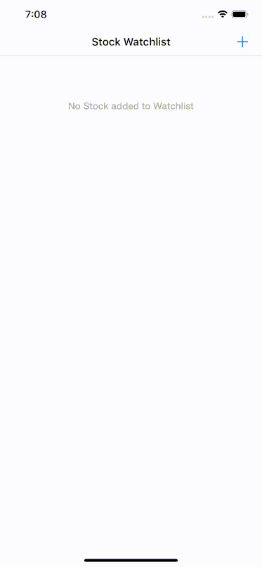

## WatchlistApp Demo

This is a demo Stock Watchlist app using Yahoo Finance API

## Architecture

This is written in Swift using MVVM pattern.

On application launch, if stocks already present in Watchlist, it will immedately start fetching data from api for every 15 seconds.
Auto fecthing will stop when app enters background.
User can be able to flip between %change and $change on the UI by clicking on the Red/Green market change view. (Similar to iOS default Stocks app).
No third party library used.

## Demo

